# Intelligent Financial Assistant

An intelligent financial management platform built with a microservices architecture. This project aims to simplify personal finance management through automated tracking, categorization, and intelligent insights.

## 🏗️ Architecture

The project relies on a modern 3-tier architecture:

### 1. Backend (Spring Boot Microservices)
The core logic is distributed across several scalable microservices:
*   **Gateway Service:** Entry point for all client requests.
*   **Auth Service:** Manages user authentication (JWT) and users.
*   **Account Service:** Handles bank accounts and balances.
*   **Transaction Service:** Manages deposits, withdrawals, transfers, and history.
*   **Recipient Service:** Manages beneficiary lists for transfers.
*   **Discovery Service (Eureka):** Service registration and discovery.
*   **Config Service:** Centralized configuration management.

### 2. Frontend Web (Angular)
A responsive and modern web dashboard for users to manage their finances.
*   **Tech Stack:** Angular 17, Angular Material, Chart.js.
*   **Features:**
    *   Dashboard with real-time statistics (Charts).
    *   Transaction history with advanced filters.
    *   Secure authentication.
    *   Account management.
    *   Transaction operations (Deposit, Withdrawal, Transfer).

### 3. Mobile App (Flutter)
A cross-platform mobile application for on-the-go access.
*   **Tech Stack:** Flutter / Dart, Firebase (Push Notifications).
*   **Features:**
    *   **Authentication:** Secure login and splash screen.
    *   **Onboarding:** Introduction to the app features.
    *   **Dashboard:** Home screen with summary views.
    *   **Accounts:** Manage bank accounts.
    *   **Transactions:** View history and perform transactions.
    *   **Assistant:** Intelligent financial assistant.
    *   **Recipients:** Manage transfer beneficiaries.
    *   **Notifications:** Real-time push notifications.
    *   **Settings:** App configuration.

---

## 📷 Screenshots

### Web Dashboard (Angular)
<div style="display: flex; flex-wrap: wrap; gap: 10px;">
  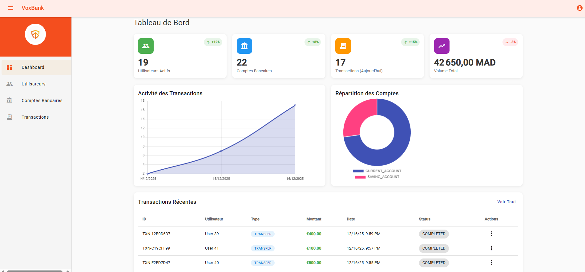
  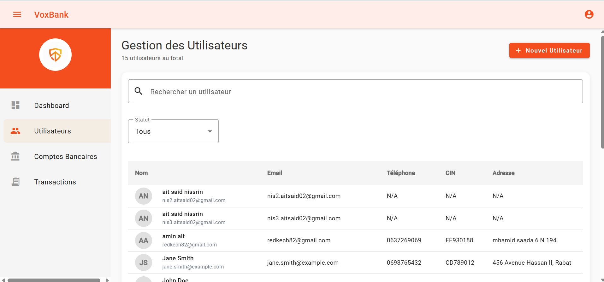
  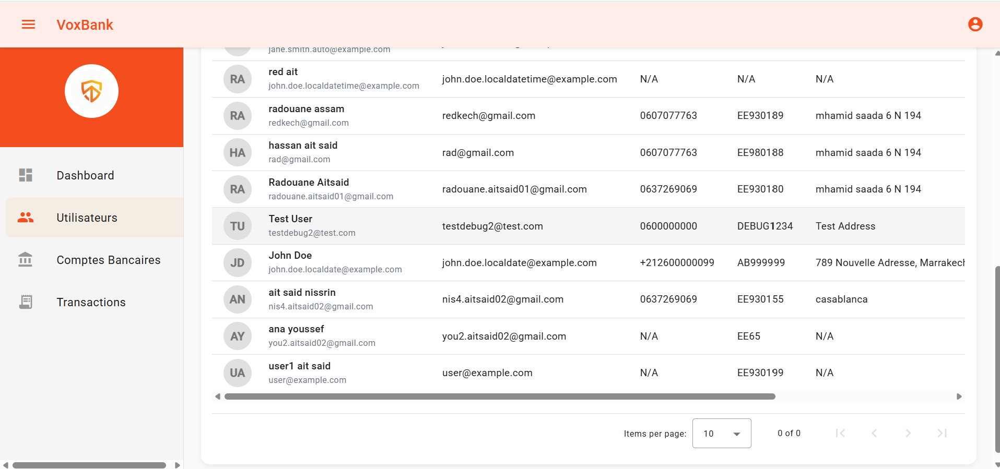
  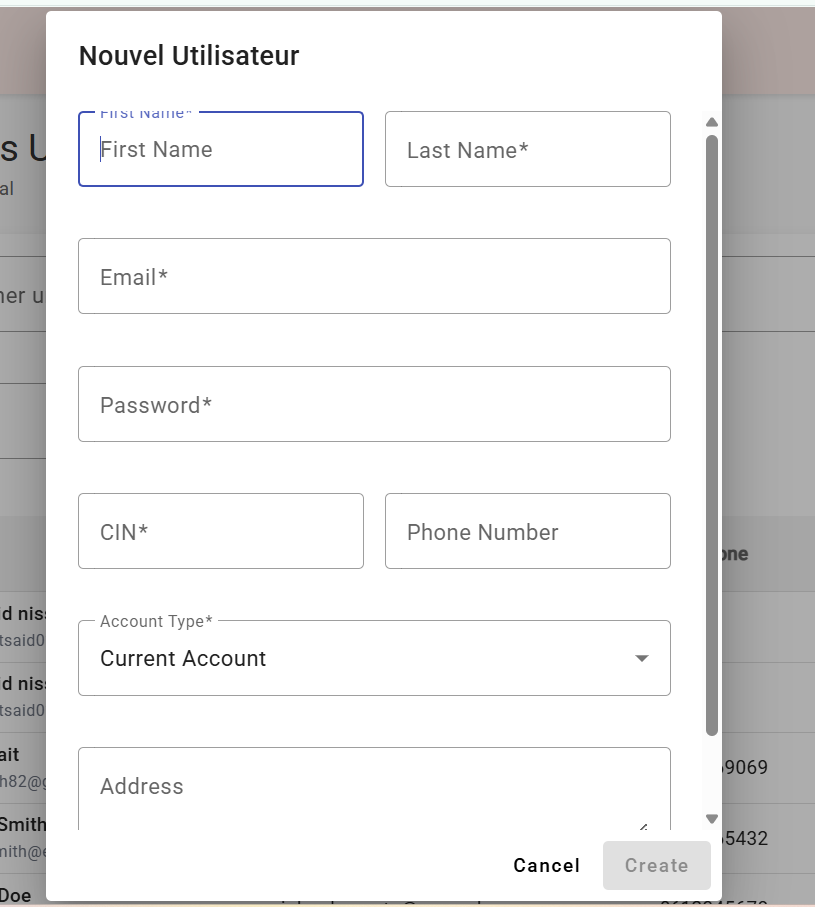
  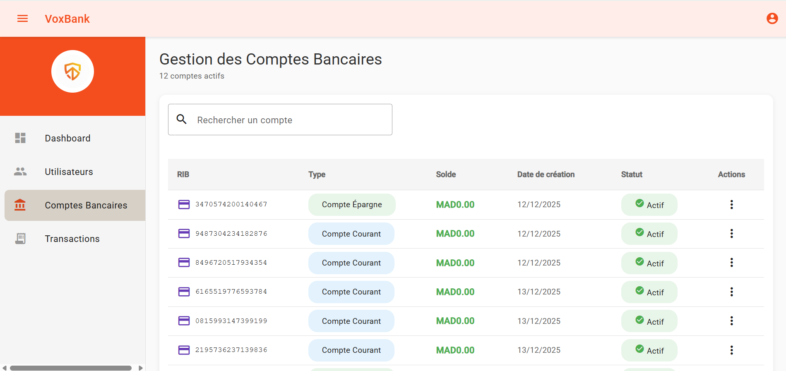
  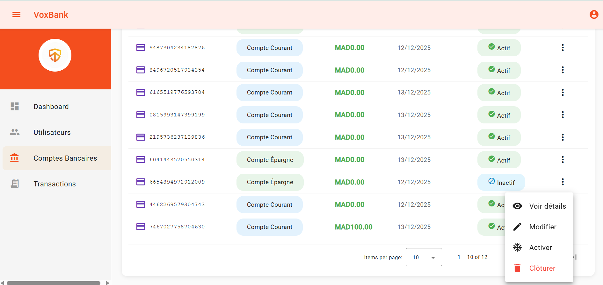
  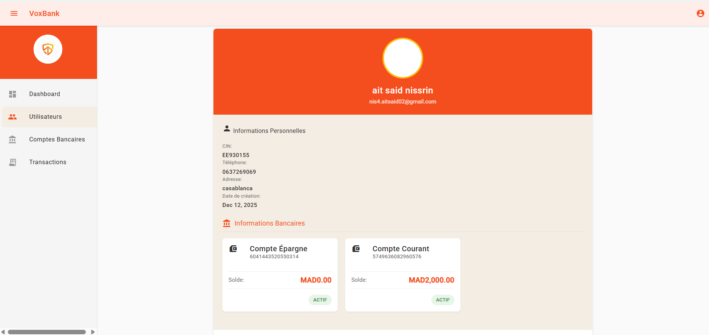
  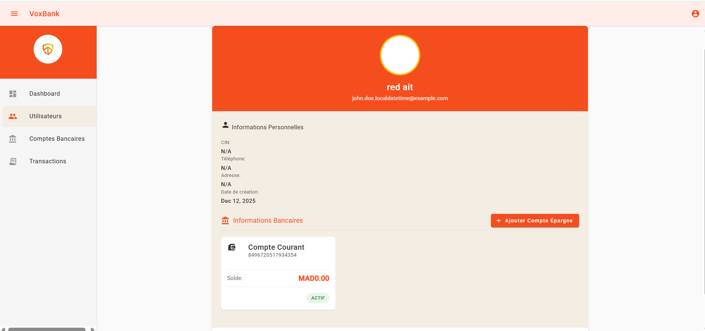
  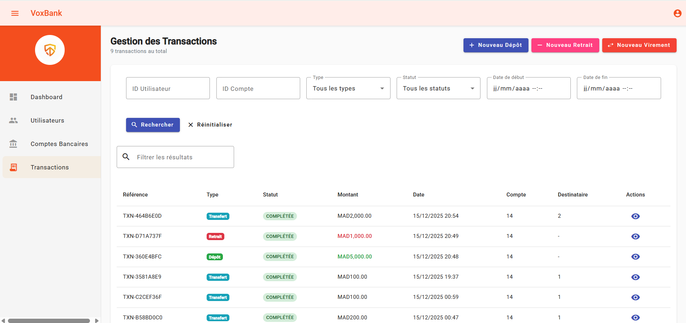
  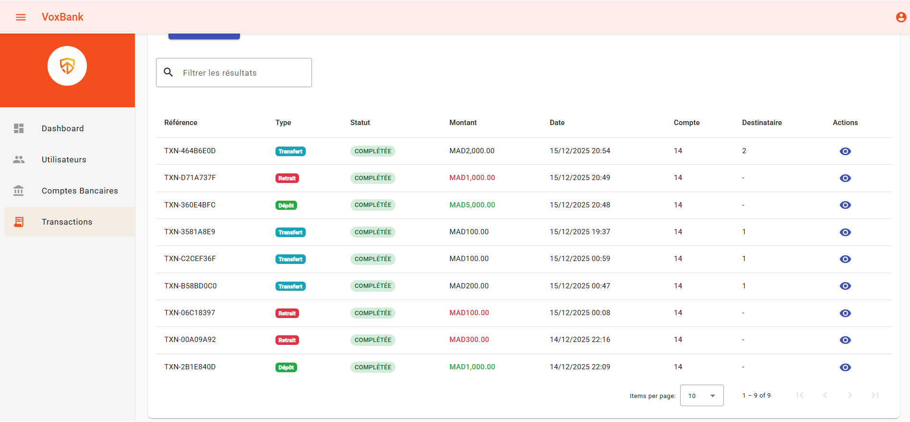
  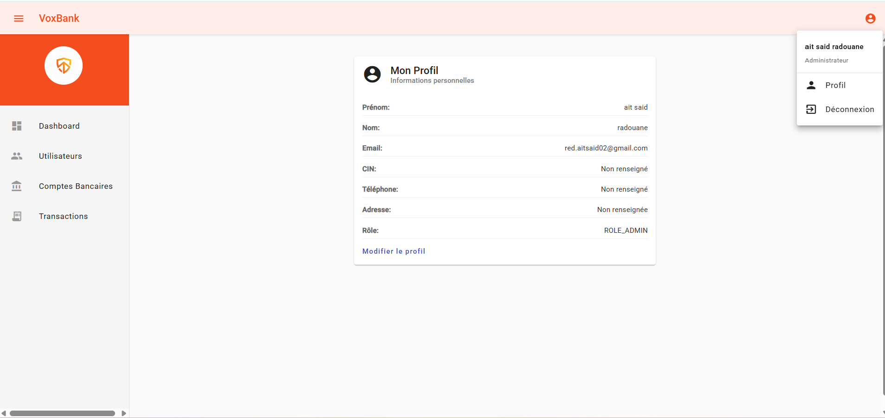
  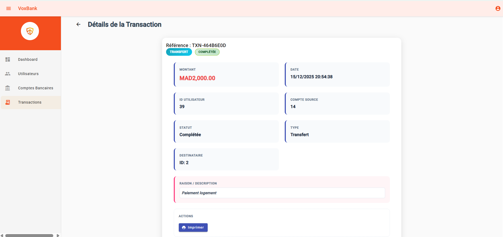
  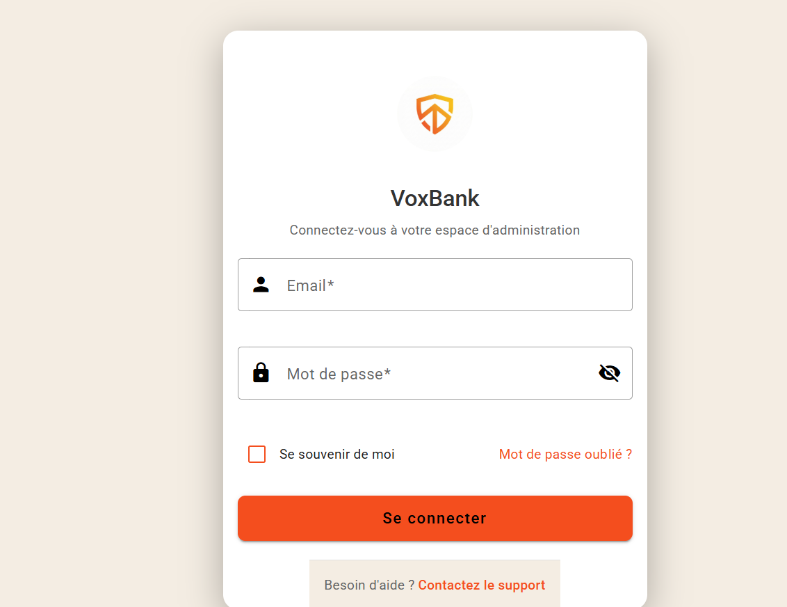
</div>

### Mobile App (Flutter)
## 🎥 Video Demo

<!-- Add a link to a video demo or embed it here -->
<!-- Example: [Watch the Demo](link_to_video) -->


https://github.com/user-attachments/assets/9c7e7c3d-c6e0-4827-98a1-33e36d1deced


### Project Walkthrough
*Placeholder for Video Demo Link*

---

## 🚀 Getting Started

### Prerequisites
*   Java 17+
*   Node.js & npm
*   Docker (optional, for containerization)

### Running the Backend
1.  Navigate to `intelligent_financial_assistant_backend`.
2.  Start the **Discovery Service** first.
3.  Start **Config Service**, then **Gateway Service**.
4.  Start core services: **Auth**, **Account**, **Transaction**.

### Running the Frontend (Web)
```bash
cd intelligent_financial_assistant_frontend_web
npm install
ng serve
```
Access the web app at `http://localhost:4200`.

### Running the Mobile App
```bash
cd intelligent_financial_assistant_frontend
flutter pub get
flutter run
```
